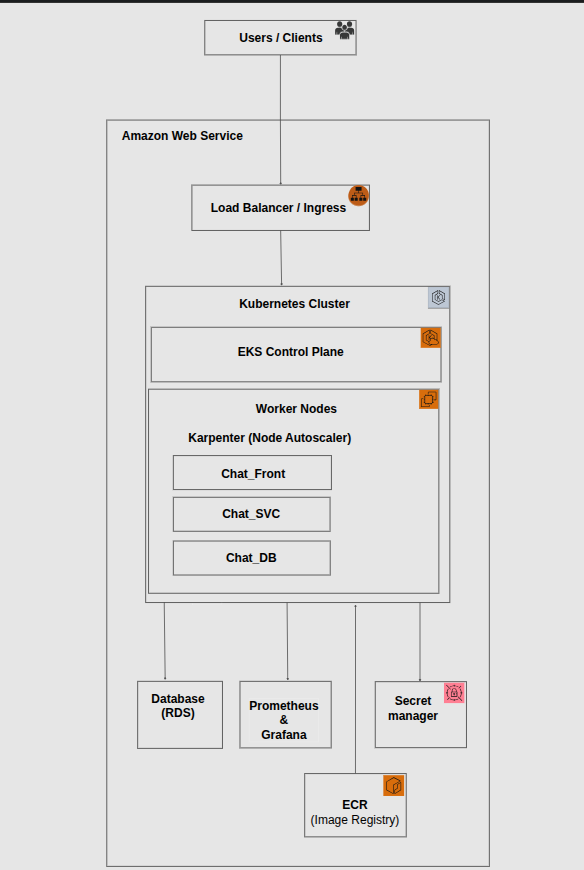

# Production-Grade Cloud-Native DevOps Platform

## Overview

This project demonstrates a production-grade cloud-native DevOps platform built using Kubernetes, CI/CD automation, GitOps, and observability tools.

It simulates how modern engineering teams design, deploy, and operate microservices-based systems in the cloud.

---

## Project Objective

See full details here:  
[Project Outline](./docs/PROJECT_OUTLINE.md)

---

## System Architecture

### High-Level Runtime Architecture



This diagram illustrates how user requests flow through the system, including load balancing, API routing, Kubernetes orchestration, and supporting infrastructure such as databases, monitoring, and secrets management.

For a detailed explanation, see:  
[Architecture Documentation](./docs/architecture/README.md)

---

## Tech Stack

- AWS (EKS, ECR, RDS, Secrets Manager)
- Kubernetes
- Terraform (IaC)
- Docker
- GitHub Actions / Jenkins (CI/CD)
- ArgoCD (GitOps)
- Prometheus & Grafana (Monitoring)

---

## DevOps Lifecycle

- Plan → Architecture & Design  
- Build → Microservices Development  
- Containerize → Docker Images  
- Deploy → Kubernetes + GitOps  
- Monitor → Prometheus & Grafana  

---

## Project Structure

```text
.
├── docs/
│   ├── PROJECT_OUTLINE.md
│   └── architecture/
│       ├── runtime/
│       └── delivery/
├── infra/
│   ├── modules/
│   │   ├── vpc/
│   │   ├── eks/
│   │   ├── rds/
│   │   └── ecr/
│   ├── envs/
│   │   ├── dev/
│   │   ├── staging/
│   │   └── prod/
│   └── terraform.tfvars
├── apps/
│   ├── api-gateway/
│   ├── auth-service/
│   ├── user-service/
│   └── product-service/
├── ci/
│   └── github-actions/
├── gitops/
│   ├── argocd/
│   └── manifests/
└── observability/
    ├── prometheus/
    └── grafana/
```